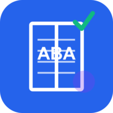

# ABA Mastery - Therapist Exam Preparation



A comprehensive Progressive Web App (PWA) for Applied Behavior Analysis (ABA) therapist certification exam preparation. This app covers all major aspects of the ABA field with study materials, practice exams, flashcards, and progress tracking.

**A product of Bradley Virtual Solutions, LLC**

## 🌐 Live Application

- **Live App**: https://aba-mastery-app.web.app
- **GitHub**: https://github.com/ronb12/ABA-Mastery
- **Firebase Console**: https://console.firebase.google.com/project/aba-mastery-app/overview

## 🎯 Features

### 📚 **Comprehensive Study Materials**
- 8 major category areas covering all aspects of ABA
- 38+ detailed topic modules
- In-depth content with key points for each topic
- Search and filter functionality

### ✍️ **Practice Exams**
- 25+ practice questions across all categories
- Multiple difficulty levels (Beginner, Intermediate, Advanced)
- Customizable quiz length and category selection
- Instant feedback with detailed explanations
- Score tracking and performance analytics

### 🎴 **Flashcards**
- 25+ flashcard sets
- Categorized by topic area
- Flip animation for engaging study
- Perfect for quick review sessions

### 📊 **Progress Tracking**
- Track questions answered and accuracy rate
- Monitor study time
- Category-specific progress breakdown
- Recent activity history
- Visual progress indicators

### 🌙 **Advanced PWA Features**
- **Offline Support**: Study anywhere, even without internet
- **Installable**: Add to home screen for app-like experience
- **Dark Mode**: Reduce eye strain during extended study sessions
- **Responsive Design**: Works perfectly on mobile, tablet, and desktop
- **Fast Performance**: Optimized loading and caching strategies

## 📖 Content Coverage

The app covers all major domains of ABA practice:

1. **Foundations of ABA** - History, philosophy, and basic principles
2. **Assessment & Evaluation** - FBA, measurement systems, data collection
3. **Intervention Strategies** - Reinforcement, prompting, behavior reduction
4. **Verbal Behavior** - Mands, tacts, intraverbals, echoics
5. **Ethics & Professional Conduct** - BACB Ethics Code, confidentiality, boundaries
6. **Research Methods** - Single-subject designs, experimental control
7. **Skill Acquisition** - Task analysis, shaping, generalization
8. **Autism Spectrum Disorder** - Evidence-based practices, social skills
9. **Systems & Service Delivery** - Collaboration, cultural competence

## 🚀 Getting Started

### Prerequisites

- [Node.js](https://nodejs.org/) (optional, for local development server)
- [Firebase CLI](https://firebase.google.com/docs/cli) (for deployment)
- Modern web browser (Chrome, Firefox, Safari, Edge)

### Installation

1. **Clone the repository:**
   ```bash
   git clone https://github.com/ronb12/ABA-Mastery.git
   cd ABA-Mastery
   ```

2. **Open locally:**
   Simply open `index.html` in your web browser, or use a local server:
   ```bash
   # Using Python
   python -m http.server 8000
   
   # Using Node.js (http-server)
   npx http-server
   ```

3. **Access the app:**
   Navigate to `http://localhost:8000` in your browser

## 🔥 Firebase Deployment

### Initial Setup

1. **Install Firebase CLI:**
   ```bash
   npm install -g firebase-tools
   ```

2. **Login to Firebase:**
   ```bash
   firebase login
   ```

3. **Initialize Firebase project:**
   ```bash
   firebase init hosting
   ```
   - Select your Firebase project or create a new one
   - Use `.` as your public directory
   - Configure as a single-page app: Yes
   - Don't overwrite existing files

### Deploy to Firebase Hosting

**Manual Deployment** (Recommended):
```bash
firebase deploy --only hosting
```

Your app will be live at: `https://aba-mastery-app.web.app`

### Custom Domain (Optional)

1. Go to Firebase Console > Hosting
2. Click "Add custom domain"
3. Follow the DNS configuration steps
4. Your app will be accessible via your custom domain

## 📱 Installing as PWA

### On Mobile (iOS/Android)

**iOS (Safari):**
1. Open the app in Safari
2. Tap the Share button
3. Scroll down and tap "Add to Home Screen"
4. Name it "ABA Mastery" and tap "Add"

**Android (Chrome):**
1. Open the app in Chrome
2. Tap the three-dot menu
3. Tap "Add to Home Screen"
4. Confirm installation

### On Desktop

**Chrome/Edge:**
1. Click the install icon in the address bar
2. Or click three-dot menu > "Install ABA Mastery"

**The app will now work offline and feel like a native application!**

## 🛠️ Technology Stack

- **Frontend**: HTML5, CSS3 (Custom Properties), Vanilla JavaScript
- **PWA**: Service Workers, Web App Manifest, Cache API
- **Storage**: LocalStorage for user data persistence
- **Hosting**: Firebase Hosting
- **Version Control**: Git, GitHub
- **Icons**: SVG with PNG exports in multiple sizes
- **Fonts**: Google Fonts (Inter)

## 📂 Project Structure

```
ABA Mastery/
├── index.html              # Main application HTML
├── styles.css              # Application styles with dark mode
├── app.js                  # Core application logic
├── content.json            # Study content and questions
├── manifest.json           # PWA manifest
├── sw.js                   # Service worker for offline support
├── firebase.json           # Firebase hosting configuration
├── .firebaserc             # Firebase project settings
├── .gitignore              # Git ignore rules
├── README.md               # This file
├── icons/                  # App icons in multiple sizes
│   ├── icon-72.png
│   ├── icon-96.png
│   ├── icon-128.png
│   ├── icon-144.png
│   ├── icon-152.png
│   ├── icon-192.png
│   ├── icon-384.png
│   ├── icon-512.png
│   └── icon.svg           # Source SVG icon
└── .github/
    └── workflows/
        └── firebase-hosting.yml  # CI/CD workflow (commented out)
```

## 🎨 Customization

### Adding New Questions

Edit `content.json` and add to the `practiceQuestions` array:

```json
{
  "id": "q26",
  "category": "foundations",
  "difficulty": "beginner",
  "question": "Your question here?",
  "options": ["Option 1", "Option 2", "Option 3", "Option 4"],
  "correctAnswer": 0,
  "explanation": "Explanation of the correct answer"
}
```

### Adding New Topics

Add to the `topics` array within a category in `content.json`:

```json
{
  "id": "topic-id",
  "title": "Topic Title",
  "content": "Detailed content...",
  "keyPoints": [
    "Point 1",
    "Point 2"
  ]
}
```

### Modifying Styles

Edit `styles.css` - the app uses CSS custom properties for easy theming:

```css
:root {
  --primary-color: #2563eb;
  --secondary-color: #7c3aed;
  /* ... more variables */
}
```

## 📊 Data Management

### User Data

All user progress is stored locally using `localStorage`:
- Questions answered
- Accuracy rates
- Study time
- Topics studied
- Recent activity

### Exporting Data

Users can export their study data from Settings > Export Study Data

### Resetting Progress

Users can reset all progress from Settings > Reset All Progress

## 🔒 Privacy & Security

- **No Server-Side Storage**: All user data stored locally
- **No Tracking**: No analytics or tracking scripts
- **No Personal Information**: App doesn't collect any personal data
- **Offline First**: Works completely offline after initial load
- **Secure Headers**: CSP and security headers configured in Firebase

## 🐛 Troubleshooting

### App Won't Install
- Ensure you're using HTTPS (required for PWA)
- Check browser compatibility
- Clear cache and reload

### Content Not Loading
- Check internet connection (initial load)
- Clear browser cache
- Verify `content.json` is valid JSON

### Service Worker Issues
- Unregister old service workers in DevTools
- Clear all site data
- Hard refresh (Ctrl+Shift+R or Cmd+Shift+R)

## 📈 Future Enhancements

- [ ] Additional practice questions (goal: 100+)
- [ ] Timed exam mode
- [ ] Study streaks and achievements
- [ ] Spaced repetition algorithm for flashcards
- [ ] Community-contributed questions
- [ ] Multi-language support
- [ ] Audio pronunciation for terms
- [ ] Study group features

## 🤝 Contributing

This is a proprietary product of Bradley Virtual Solutions, LLC. For collaboration inquiries, please contact the development team.

## 📄 License

© 2025 Bradley Virtual Solutions, LLC. All rights reserved.

This application is provided for educational purposes. Content is based on publicly available ABA resources and the BACB Task List.

## 👨‍💻 Developer

**Bradley Virtual Solutions, LLC**

For support or inquiries:
- GitHub: [@ronb12](https://github.com/ronb12)

## 🙏 Acknowledgments

- BACB (Behavior Analyst Certification Board) for establishing professional standards
- ABA research community for foundational knowledge
- Open-source community for web technologies

## 📚 Resources

- [BACB Website](https://www.bacb.com/)
- [BACB Task List](https://www.bacb.com/bcba/bcba-task-list/)
- [Ethics Code](https://www.bacb.com/ethics-information/ethics-code/)

---

**Version**: 1.0.0  
**Last Updated**: October 17, 2025

---

## 🚀 Quick Start Commands

```bash
# Clone the repository
git clone https://github.com/ronb12/ABA-Mastery.git

# Navigate to directory
cd ABA-Mastery

# Deploy to Firebase
firebase deploy --only hosting

# Open locally
open index.html
# or
python -m http.server 8000
```

**Made with ❤️ for ABA professionals worldwide**

